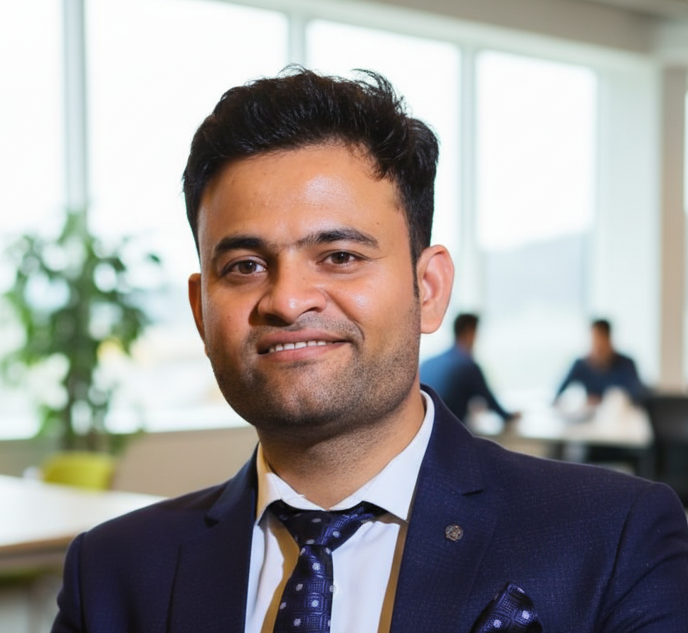

<h1 align="center">Hi there, I'm Bharat Mishra </h1>

  

  <strong>Analytics Pro, Solving business growth with 3A - Analytics, Automation and AI</strong> 
  12+ Years across India & Middle East | Paytm | Landmark Group | NowNow | Publicis Sapient

  
  
  
  

---

### About Me

Over the last 12+ years, I've worked across India and the Middle East with some of the most dynamic brands like Paytm, Centrepoint Stores, Landmark Group, NowNow, and currently, Publicis Sapient. This journey has given opportunity to work across industries, helping businesses understand their customers, optimize digital journeys, and make smarter decisions.

I've led analytics teams, built scalable reporting systems, and translated complex patterns into clear, actionable insights. Whether it's improving performance, guiding strategy, or setting up measurement frameworks, I focus on making data useful for everyone.

- Currently working as **Manager - Digital Analytics** at **Publicis Sapient**, Gurugram
- **MBA in Business Analytics** from **Jindal Global Business School**
- **ISB** certified in Digital Marketing & Analytics | **Duke University** certified in Product Management
- I also offer **Interview Preparation** and **Career Development Coaching**
- Languages: English (Professional Working) | Hindi (Full Professional)

---

### Work Experience

| Role | Company | Duration | Location |
|------|---------|----------|----------|
| Manager - Digital Analytics | Publicis Sapient | Apr 2025 - Present | Gurugram |
| Head of Business Analytics | NowNow Digital | Mar 2023 - Mar 2025 | Delhi |
| Business Analytics Manager | NowNow Digital | Nov 2022 - Mar 2023 | Delhi |
| Senior Business Analyst | Landmark Group | Sep 2022 - Nov 2022 | Dubai, UAE |
| Business Analyst | Landmark Group | Oct 2020 - Sep 2022 | Dubai, UAE |
| Analytics Consultant | Landmark Group (DataLabs) | Aug 2019 - Sep 2020 | Bangalore |
| Business Analyst | Paytm | Oct 2016 - Aug 2019 | Noida |
| Associate Operations | Paytm | Sep 2015 - Oct 2016 | Noida |
| Assistant Operations | RR Financial Consultants | Aug 2014 - Aug 2015 | New Delhi |
| Retail Operations | Lifestyle International | Feb 2013 - Mar 2014 | Noida |
| Customer Service Associate | Andromeda BPO | Jun 2012 - Dec 2012 | Noida |

---

### Tech Stack

  
  
  
  
  
  
  
  
  
  
  
  
  
  
  
  
  
  
  

---

### Key Highlights

- Led unsupervised text clustering (TF-IDF & BERT) on 2K+ blog articles for content strategy at Publicis Sapient
- Worked directly with C-suite executives to develop Go-To-Market (GTM) strategies at NowNow
- Built attribution models combining data from multiple sources/platforms at Landmark Group (Dubai)
- Translated annual sale budgets into daily traffic, sales & margin plans for Centrepoint E-Commerce
- Implemented RFM analysis and K-Means clustering, achieving **10% uplift in customer retention** at Paytm
- Performed **Sentiment Analysis** of Google Play Store data for Paytm App using Python
- Saved **5-8% in database costs** by optimizing BigQuery storage and querying processes
- Automated **10+ recurring reports**, reducing manual effort by **30 hours/month**
- Led GA implementation for **Paytm, Paytm Mall, and Paytm First Games**
- Designed **15+ interactive dashboards** in Google Data Studio
- Mentored a team of 4 analysts across Sales, Marketing, and Growth

---

### Awards

- **Rockstar** at Paytm (Jul 2016)
- **Rising Star** at Paytm (Dec 2015)

---

### Education

| Degree / Certificate | Institution | Year |
|---------------------|------------|------|
| MBA, Business Analytics | Jindal Global Business School (JGBS) | 2025 - 2026 |
| Certificate, Digital Marketing & Analytics | Indian School of Business (ISB) | 2024 - 2025 |
| Master's, Industrial & Organizational Psychology | IGNOU | 2021 - 2023 |
| Certificate, Product Management | Duke University | 2021 - 2022 |
| Applied Data Science | WorldQuant University | 2019 - 2020 |
| Bachelors in Commerce | Delhi University | 2012 - 2015 |

---

### Certifications

- Big Data Foundations - Level 1 (IBM)
- Hadoop Data Access - Level 1 (IBM)
- Data Science Foundations - Level 1 (IBM)
- Google Analytics Certified
- Google Ads (Display, Mobile, Video, AdWords)
- Advanced SQL for Data Scientists (Lynda.com)
- Programming Foundations: Fundamentals, OOD, Databases (LinkedIn Learning)
- Unsupervised Learning in R (LinkedIn Learning)
- Product Management - Growth & AI Specialization (LinkedIn Learning)
- Retail Management (NISBUD, Ministry of MSME, Govt. of India)

---

### Articles & Publications

- [How to be a Business Analyst?](https://www.linkedin.com/in/meetbharat101/recent-activity/articles/) - Jan 2021
- [28 Things I learned in the last 28 years](https://www.linkedin.com/in/meetbharat101/recent-activity/articles/) - Feb 2021
- [What is the data science process?](https://www.linkedin.com/in/meetbharat101/recent-activity/articles/) - Feb 2021
- [History & Story of Machine Learning Transformations](https://www.linkedin.com/in/meetbharat101/recent-activity/articles/) - Dec 2017
- [An Overview of Machine Learning Methods](https://www.linkedin.com/in/meetbharat101/recent-activity/articles/) - Dec 2017

---

### GitHub Stats

  
  

---

  

<i>"Analytics Pro, Solving business growth with 3A - Analytics, Automation and AI."</i>

